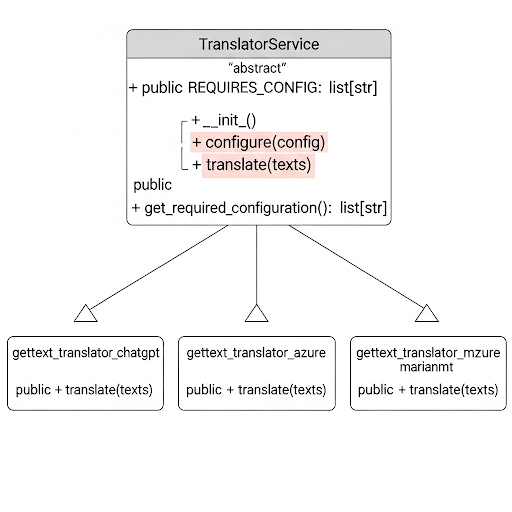

# gettext-translator

[](https://www.gnu.org/licenses/gpl-3.0.html)


This program uses several cloud and local AI models to translate [gettext](https://www.gnu.org/software/gettext/) [PO](https://www.gnu.org/software/gettext/manual/html_node/PO-Files.html) files.

## Backends

To use `gettext-translator` as a command-line tool, see the `README.md` file in each plugin's directory for examples:

Currently this system works with the following backends:

- **Azure AI Translator** ([README](translators/gettext-translator-azure/README.md)): remote API, commercial, API key required.
- **OpenAI ChatGPT** ([README](translators/gettext-translator-chatgpt/README.md)): remote API, several models, commercial, API key required.
- **MarianMT** ([README](translators/gettext-translator-marianmt/README.md)): local *Helsinki-NLP* model, free, auth token might be required.
- **NLLB** ([README](translators/gettext-translator-nllb/README.md)): local model, free, auth token might be required.

Please remember: refer to each plugin's `README.md` files listed above to view information about each plugin.

## General arguments

The command line tool supports the following arguments:

- ```--info```: Shows information about the backend.
- ```--backend```: Which backend to use.
- ```--po```: The path to the .po file.
- ```--src```: The source language.
- ```--dst```: The language to translate to.
- ```--fuzzy```: Fuzzy translations?
- ```--ascribe```: Include a comment in each entry indicating that it was translated with AI.
- ```--config```: Path to the YAML configuration file for the backend.
- ```--help```: Shows the help message.

### Examples

First, change to the `src/gettext_translator` directory:

```bash
cd src/gettext_translator/
```

Show information about the ChatGPT backend:

```bash
python gettext_translator.py --info --backend chatgpt
```

Translate using the Azure AI Translator backend:

```bash
python gettext_translator.py --backend azure --src es --dst de_DE --config ../../translators/gettext-translator-azure/azure-sample.yaml --po ../../example/messages.po
```

Translate using the ChatGPT backend, adding a comment attributing translations to AI:

```bash
python gettext_translator.py --backend chatgpt --src es --dst de_DE --config ../../translators/gettext-translator-chatgpt/chatgpt-sample.yaml --po ../../example/messages.po --ascribe=true
```

## Requirements

See the `requirements.txt` files in the main CLI program directory and in each of the plugin directories.

## Installation

### From source code

You can install the main CLI program and each plugin using `pip` from their respective root directories. For example:

Change to a translator directory, for example:

```bash
cd translators/gettext-translator-azure/
```

Install it:

```bash
pip install .
```

If you want to modify something, install the plugins in editable mode:

```bash
pip install -e .
```

## Information about the plugins

You can view which options are available for each plugin using the `--info` argument:

```bash
python gettext_translator.py --info --backend chatgpt
```

<pre>
{
  "REQUIRES": [
    "apikey",
    "model"
  ]
}
</pre>

```bash
python gettext_translator.py --info --backend azure
```

<pre>
{
  "REQUIRES_CONFIG": [
    "apikey",
    "location",
    "endpoint"
  ]
}
</pre>

See the README.md files in each plugin's directory under ```translators/``` for more information about the options supported by each plugin.

## Architecture

This software was designed with extensibility as a priority, so it's not restricted to a single service or provider. It is based on an auto-discovery plugin system, and users can create additional plugins as needed.



## Notes

* It is recommended that you learn about [gettext](https://www.gnu.org/software/gettext/) and the [format of PO files](https://www.gnu.org/software/gettext/manual/html_node/PO-Files.html). But of course, if you are reading this, you should already know it.
* Why gettext?
  * It uses full strings in the source language as keys. This is the most relevant reason, as it means you don't have to search for abstract keys like `page.title.hello` or `item.specification`. While that approach may work for a few strings, it becomes complicated and chaotic with hundreds or thousands of them.
  * The original key string is used as a fallback. If a translation doesn't exist, the original string is displayed.
  * It's a tried and trusted GNU standard.
* For the example PO file, the best contextual results were obtained using Azure's AI Translator service.

## License

Copyright (C) 2026 Rodolfo González González.

Licensed under [GPL 3.0](https://www.gnu.org/licenses/gpl-3.0.html).